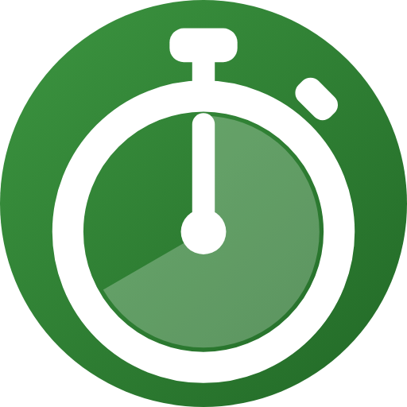

  

<h1 align="center">Kronometre</h1>

  Ekran kapalıyken de doğru sayan, pil yemeyen, sade bir Android kronometre ve zamanlayıcı.

  <a href="https://github.com/DorDeorz/Kronometre/releases/latest"><b>⬇ Son sürümü indir (APK)</b></a>

---

## Neden bu uygulama?

Çoğu kronometre uygulaması ekranda saniyeyi göstermek için arka planda sürekli çalışır ve telefonu ısıtır.
Kronometre ise süreyi **saymaz, hesaplar**: başlattığın anı kaydeder ve geçen süreyi her baktığında yeniden hesaplar.
Bildirimdeki ve widget'taki canlı süreyi Android'in kendisi çizer. Böylece kronometre saatlerce çalışsa da
uygulamanın kendi pil ve işlemci kullanımı neredeyse sıfırda kalır.

- **Doğru:** Saat değişse, telefon uyusa ya da uygulamayı kapatsan bile süre kaymaz.
- **Hafif:** Kurulum dosyası 3 MB'ın altında. Reklam, hesap ve internet izni isteyen bir özellik yok (internet sadece "Güncellemeleri denetle" için kullanılır).
- **Her yerde:** Bildirimden, kilit ekranından ve ana ekran widget'ından kontrol edilir.

## Özellikler

| | |
|---|---|
| ⏱ **Kronometre** | Başlat, duraklat, tur al, sıfırla. En hızlı tur yeşil, en yavaş tur kırmızı gösterilir. Turlar tek dokunuşla panoya kopyalanır. Uygulama açıkken salise gösterilir. |
| ⏲ **Zamanlayıcı** | Tuş takımıyla süre gir, başlat. Bildirimden duraklat, +1 dk ekle ya da iptal et. Süre dolunca alarm sesi ve titreşimle haber verir. |
| 🔔 **Bildirim** | Büyük, canlı süre. Kilit ekranında da görünür ve kapatılamaz. Duraklatınca Sürdür ve Sıfırla düğmeleri çıkar. |
| 🧩 **Widget** | Yeniden boyutlandırılabilir. Süre ve düğmeler widget'ın boyutuna göre büyür. Başlat, Duraklat, Tur ve Sıfırla doğrudan widget'tan çalışır. |
| 🌙 **Ekran karartma** | Kronometre çalışırken 10 saniye dokunulmazsa ekran kararır, dokununca geri gelir. Ayarlardan kapatılabilir. |
| ⚙️ **Ayarlar** | Açık / koyu / sistem teması, salise, ekran karartma, güncelleme denetimi ve GitHub sayfası. |
| 🔋 **Pil yardımı** | Xiaomi, Samsung, Huawei, Oppo, Vivo gibi uygulamaları arka planda kapatan markalarda hangi ayarın açılması gerektiğini gösterir. |

## Ekran görüntüleri

_Yakında eklenecek._

## Kurulum

1. [Sürümler](https://github.com/DorDeorz/Kronometre/releases/latest) sayfasından `app-release.apk` dosyasını indir.
2. Telefonda dosyayı aç. İstenirse tarayıcına veya dosya yöneticine **bilinmeyen uygulamaları yükleme** izni ver.
3. Uygulamayı aç ve bildirim iznine izin ver.

**Güncelleme:** Yeni sürümün APK'sını aynı şekilde kurman yeterli. Uygulama üzerine güncellenir, kronometre ve ayarların korunur.
Ayarlar → **Güncellemeleri denetle** yeni sürüm olup olmadığını söyler.

> Xiaomi / Redmi / POCO, Samsung ve benzeri telefonlarda uygulama ilk açılışta pil ayarları için kısa bir yardım kartı gösterir.
> Bu adımlar yapılmazsa sistem ekran kapandıktan birkaç dakika sonra kronometre bildirimini kapatabilir.

## Gizlilik

Uygulama hiçbir kişisel veri toplamaz ve hiçbir yere göndermez. Kronometre, zamanlayıcı ve ayarlar yalnızca telefonda saklanır.
İnternet bağlantısı sadece sen **Güncellemeleri denetle**'ye bastığında GitHub'daki son sürüm numarasını okumak için kullanılır.

## Geliştiriciler için

- Android 6.0 (API 23) ve üstü; Kotlin, Jetpack Compose, Glance widget, DataStore.
- Derleme: `./gradlew assembleDebug` · Testler: `./gradlew testDebugUnitTest` · Lint: `./gradlew lint`
- Mimari, pil ölçüm protokolü, marka bazında ayarlar ve manuel test listesi: [docs/TEKNIK.md](docs/TEKNIK.md)
- Yeni sürüm: `vX.Y.Z` etiketi itilince GitHub Actions imzalı APK ve AAB üretip sürüm sayfasına ekler.
